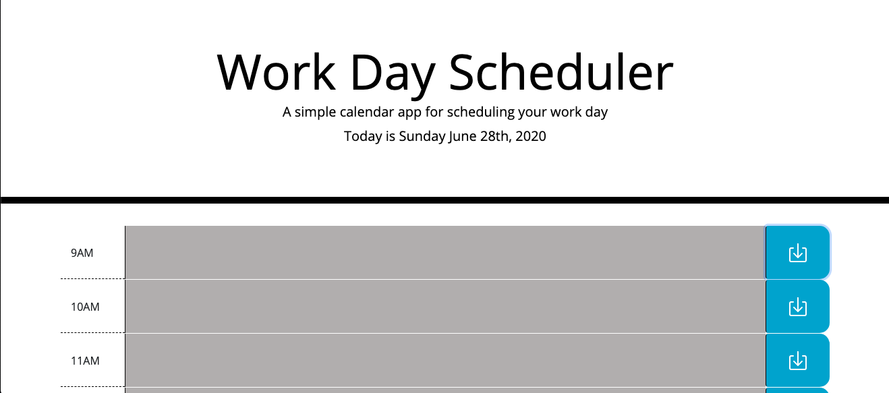

# Work Day Scheduler

## Live application available at: https://cullinans1.github.io/Work-Day-Scheduler/

### Functions of this scheduler are: 
 * Current date is displayed at the top of the page
 * Times are set up in hour blocks from 9am-5pm
 * Enter a task in the center area and press save to save the tast
 * Reload page and it will still be there
 * Highlighted boxes represent: 
    * Gray are hour blocks that are in the past
    * Yellow is current hour block
    * Green are hour blocks in the future
* Page will automatically check time blocks in reference to current time every 30 minutes

### Screenshots for the application: 

